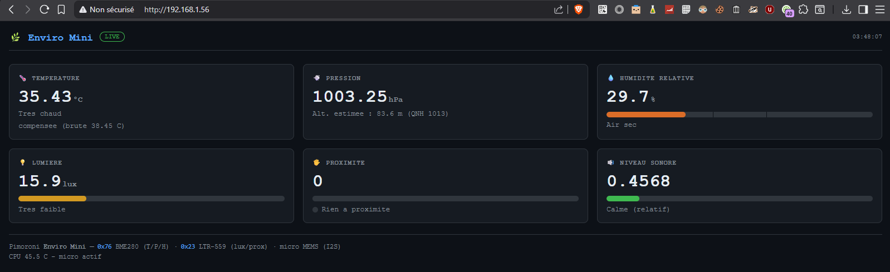

# Enviro Mini Dashboard


Dashboard web léger et auto-hébergé pour le **Pimoroni Enviro Mini** sur **Raspberry Pi Zero W**, pensé comme noeud d'un réseau de capteurs (alternative maison à une station type NetAtmo).

Aucune dépendance lourde : serveur HTTP de la stdlib Python, plus les deux libs des capteurs. Le noeud affiche une page web sombre rafraîchie toutes les 2 secondes et expose un endpoint JSON sur `/data`, directement exploitable par un agrégateur central.



## Capteurs

| Composant | Bus | Adresse | Mesures |
|-----------|-----|---------|---------|
| BME280 | I2C | `0x76` | température (compensée CPU), pression, humidité |
| LTR-559 | I2C | `0x23` | lumière (lux), proximité |
| Micro MEMS (via ADAU7002) | I2S | - | niveau sonore (amplitude relative) |

Fonctionnalités notables : compensation de la chauffe CPU sur la température, calibration du niveau sonore, et service `systemd` capable d'écouter sur le port 80 sans tourner en root.

## Prérequis

- Raspberry Pi Zero W (ou compatible)
- Pimoroni Enviro Mini
- Raspberry Pi OS **Trixie** (Debian 13)

> [!CAUTION]
> Ne pas confondre l'Enviro **Mini** et l'Enviro **pHAT** : capteurs et adresses I2C différents. Vérifier avec `i2cdetect -y 1`. Un Enviro Mini montre `0x23` et `0x76`. Si vous voyez `0x29` / `0x1d` / `0x49` / `0x77`, c'est un pHAT, et ce dépôt ne s'applique pas. Le script officiel `get.pimoroni.com/envirophat` ne sert à rien ici.

## Installation

Cloner le dépôt :

```bash
git clone https://github.com/deuza/enviromini_dashboard.git
cd enviromini_dashboard
```

### 1. Interfaces matérielles (root)

Activer l'I2C :

```bash
raspi-config nonint do_i2c 0
```

Activer le micro (I2S). Ajouter dans `/boot/firmware/config.txt` :

```
dtparam=i2s=on
dtoverlay=adau7002-simple
```

Redémarrer, puis vérifier le matériel :

```bash
i2cdetect -y 1   # doit lister 0x23 et 0x76
arecord -l       # doit lister une carte adau7002
```

> [!NOTE]
> Le SPI n'est nécessaire que pour l'écran LCD ST7735, inutile pour le dashboard web.

### 2. Paquets système (root)

```bash
apt install -y i2c-tools python3-rpi.gpio python3-smbus python3-numpy libopenblas0 libportaudio2
```

> [!WARNING]
> `libopenblas0` est obligatoire : sous Trixie, le numpy installé par pip réclame `libopenblas.so.0` et échoue sinon (`ImportError: libopenblas.so.0: cannot open shared object file`). `libportaudio2` est requis par `sounddevice` pour le micro.

### 3. Environnement Python (user pi)

```bash
python3 -m venv --system-site-packages .env
source .env/bin/activate
pip install pimoroni-bme280 ltr559 enviroplus sounddevice
```

> [!WARNING]
> Le flag `--system-site-packages` est indispensable : il permet au venv de réutiliser `RPi.GPIO` et `smbus` installés via apt.

### 4. Vérifier les capteurs

```bash
.env/bin/python3 -c "from bme280 import BME280; from smbus2 import SMBus; b=BME280(i2c_dev=SMBus(1)); print(b.get_temperature())"
.env/bin/python3 -c "from ltr559 import LTR559; l=LTR559(); print(l.get_lux(), l.get_proximity())"
.env/bin/python3 -c "from enviroplus.noise import Noise; n=Noise(); print(n.get_amplitude_at_frequency_range(20,8000))"
```

### 5. Service systemd

Copier le service fourni vers `/etc/systemd/system/enviromini.service` (adapter les chemins si besoin) :

```ini
[Unit]
Description=Enviro Mini Dashboard
After=network-online.target
Wants=network-online.target

[Service]
Type=simple
User=pi
Group=pi
WorkingDirectory=/home/pi/enviromini_dashboard
ExecStart=/home/pi/enviromini_dashboard/.env/bin/python3 /home/pi/enviromini_dashboard/enviromini_dashboard.py
AmbientCapabilities=CAP_NET_BIND_SERVICE
Restart=on-failure
RestartSec=5

[Install]
WantedBy=multi-user.target
```

```bash
systemctl daemon-reload
systemctl enable --now enviromini
systemctl status enviromini
```

> [!WARNING]
> Le port 80 est privilégié (< 1024). La ligne `AmbientCapabilities=CAP_NET_BIND_SERVICE` accorde ce seul droit au process tournant en user `pi`, sans root. En lancement manuel via `start.sh`, utiliser `authbind` ou passer un port haut : `./start.sh 8080`.

> [!NOTE]
> Si le bruit reste à `N/A` dans le service alors qu'il fonctionne en test manuel, vérifier que `pi` appartient au groupe `audio` (`groups pi | grep audio`), ou ajouter `SupplementaryGroups=audio` au bloc `[Service]`.

## Configuration

Trois constantes en tête de `enviromini_dashboard.py` :

| Constante | Défaut | Rôle |
|-----------|--------|------|
| `QNH` | `1013.25` | Pression de référence niveau mer (hPa), pour l'altitude. À régler sur la pression locale. |
| `TEMP_FACTOR` | `2.25` | Compensation de la chauffe CPU sur le BME280. À affiner contre un thermomètre de référence. |
| `NOISE_SCALE` | `0.1` | Amplitude correspondant à 100 % sur la barre de bruit. À calibrer selon le micro et l'environnement. |

> [!TIP]
> Pour calibrer le bruit, lancer ce script, faire du bruit fort près du micro, noter le max, et le reporter dans `NOISE_SCALE` :
> ```bash
> .env/bin/python3 - <<'EOF'
> from enviroplus.noise import Noise
> import time
> n = Noise()
> mx = 0.0
> print("Fais du bruit fort. Ctrl+C pour arreter.")
> try:
>     while True:
>         a = n.get_amplitude_at_frequency_range(20, 8000)
>         mx = max(mx, a)
>         print("  {:.3f}   (max {:.3f})".format(a, mx))
>         time.sleep(0.3)
> except KeyboardInterrupt:
>     print("\nMax observe : {:.3f}".format(mx))
> EOF
> ```
> Après toute modification d'une constante : `systemctl restart enviromini`.

> [!NOTE]
> Le niveau sonore est une **amplitude relative, pas des dB SPL**. C'est un indicateur de variation, pas une mesure absolue calibrée.

## Utilisation

- Interface web : `http://<hostname>/`
- Endpoint JSON : `http://<hostname>/data`

Le port d'écoute peut être passé en argument (`enviromini_dashboard.py 8080`), 80 par défaut.

## Réseau de capteurs

Chaque noeud expose son `/data` en JSON, ce qui permet un parc hétérogène agrégé par un point central.

Pour répliquer un noeud :

```bash
# Cloner la carte SD du master, puis sur le clone :
hostnamectl set-hostname enviro-salon
```

> [!TIP]
> Le hostname sert de clé d'identification côté agrégateur (salon, chambre, extérieur...) pour savoir d'où vient chaque mesure. Schéma suggéré : `enviro-<piece>`.

Pistes pour la couche centrale : **Prometheus + Grafana** (un `enviroplus_exporter` existe), ou **MQTT + InfluxDB + Grafana**. Pour couvrir le CO2 que mesure NetAtmo, ajouter un capteur dédié type SCD40 sur le bus I2C.

---

## Licence
[](https://www.wtfpl.net/)
WTFPL (Do What The Fuck You Want To Public License), version 2 - voir [LICENSE](LICENSE).
Identifiant SPDX : `WTFPL`.
